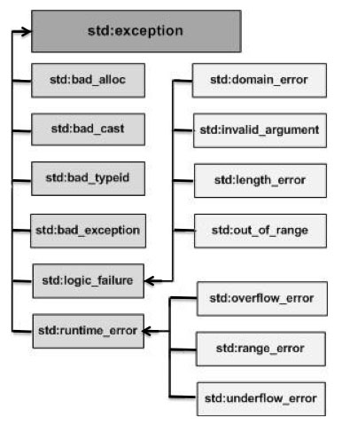

## C++ 异常处理

一个例外是一个程序执行过程中出现的问题。c++异常响应的程序运行时出现的异常情况,比如试图除以零。

异常提供一种方法来控制从一个程序的一部分转移到另一部分。c++异常处理是建立在三个关键词:尝试,捕获和抛出。

- throw:程序抛出异常时出现问题。这是使用一个 throw 关键字实现的。
- catch:程序用异常处理器在你想要处理问题的地方。抓住关键字显示异常的捕获。
- try:一个 try 块标识一个特定的异常的将被激活代码块。这是紧随其后的是一个或多个catch块。

假设一个快将引发一个异常,结合使用 catch 和 try 关键词的方法捕获了一个异常。一个 try / catch 块放置在可能生成一个异常的代码周围。在一个 try / catch 块里面的代码被称为保护代码,并使用 try / catch 的语法如下:

    try
    {
       // protected code
    }catch( ExceptionName e1 )
    {
       // catch block
    }catch( ExceptionName e2 )
    {
       // catch block
    }catch( ExceptionName eN )
    {
       // catch block
    }

你可以列出多个捕捉语句捕获不同类型的异常,以防你的试块在不同的情况下提出了超过一个例外。

### 抛出异常：
异常可以在代码块的任何地方使用抛出语句抛出。把语句的操作数确定类型的异常,可以是任何表达式,表达式的结果的类型决定了类型的异常抛出。
下面是一个例子,抛出异常除以零条件发生时:

    double division(int a, int b)
    {
       if( b == 0 )
       {
      throw "Division by zero condition!";
       }
       return (a/b);
    }

###捕获异常：
try 块后的 catch 块可以捕获任何例外。您可以指定你想要什么类型的异常捕获,这是由出现在关键字 catch 括号后的异常声明确定的。

    try
    {
       // protected code
    }catch( ExceptionName e )
    {
      // code to handle ExceptionName exception
    }
上面的代码将捕获到一个ExceptionName类型的异常。如果您想要指定一个catch块应该处理一个扔在try块里面的任何类型的异常, ,你必须把一个省略号,……之间的括号封闭，异常声明如下:

    try
    {
       // protected code
    }catch(...)
    {
      // code to handle any exception
    }
下面是一个例子,在这个例子抛出除零异常,我们在catch块里面捕获它

    #include <iostream>
    using namespace std;
    
    double division(int a, int b)
    {
       if( b == 0 )
       {
      throw "Division by zero condition!";
       }
       return (a/b);
    }
    
    int main ()
    {
       int x = 50;
       int y = 0;
       double z = 0;
     
       try {
     z = division(x, y);
     cout << z << endl;
       }catch (const char* msg) {
     cerr << msg << endl;
       }
    
       return 0;
    }
因为我们正提出一个const char *类型的异常,所以当捕捉这个异常,我们必须在catch块中使用const char *。如果我们编译和运行上面的代码,这将产生以下结果:

    Division by zero condition!
###C++标准异常：
c++提供了标准的列表<exception>中定义的异常,我们可以用在我们的程序。这些排列在一个亲子类层次结构，如下所示:
 
这是对上面提到的层次结构每个异常的描述:
异常描述
<table>
<tr>
<th>异常</th><th>描述</th>
</th>
<tr>
<td><strong>std::exception</strong></td><td>异常和所有标准c++的父类异常</td>
<tr>
<td>std::bad_alloc</td><td>这可以由新类抛出。</td>
<tr>
<td>std::bad_cast</td><td>这可以由dynamic_cast抛出。</td>
<tr>
<td>std::bad_exception</td><td>这是有用的手段在一个c++程序中处理意想不到的异常</td>
<tr>
<td>std::bad_typeid</td><td>这可以由typeid抛出。</td>
<tr>
<td><strong>std::logic_error</td><td>异常,理论上可以通过阅读代码发现。</td>
<tr>
<td>std::domain_error</td><td>这是一个在数学无效域被使用时抛出的异常。</td>
<tr>
<td>std::invalid_argument</td><td>这抛出由于无效的参数。</td>
<tr>
<td>std::length_error</td><td>太大的 std::string 被创造时，抛出异常。</td>
<tr>
<td>std::out_of_range</td><td>这可以抛出的方法例如std::vector和std::bitset < >::operator。</td>
<tr>
<td><strong>std::runtime_error</strong></td><td>理论上不能通过读代码检测到。</td>
<tr>
<td>std::overflow_errorr</td><td>这是如果出现数学溢出</td>
<tr>
<td>std::range_error</td><td>这是发生当你试图存储一个超过范围的值的时候。</td>
<tr>
<td>std::underflow_error</td><td>这是如果出现数学下溢。</td>
<tr>
<table>
 

定义新异常：
你可以定义自己的异常通过继承和压倒一切的异常类功能。下面是示例,显示如何使用std::exception类以标准的方式实现自己的异常:

    #include <iostream>
    #include <exception>
    using namespace std;
    
    struct MyException : public exception
    {
      const char * what () const throw ()
      {
    return "C++ Exception";
      }
    };
     
    int main()
    {
      try
      {
    throw MyException();
      }
      catch(MyException& e)
      {
    std::cout << "MyException caught" << std::endl;
    std::cout << e.what() << std::endl;
      }
      catch(std::exception& e)
      {
    //Other errors
      }
    }
这将产生如下的结果：

    MyException caught
    C++ 
这里, what() 是一个异常类提供的公共方法，它覆盖了所有的子异常类。这将返回一个异常的原因。
